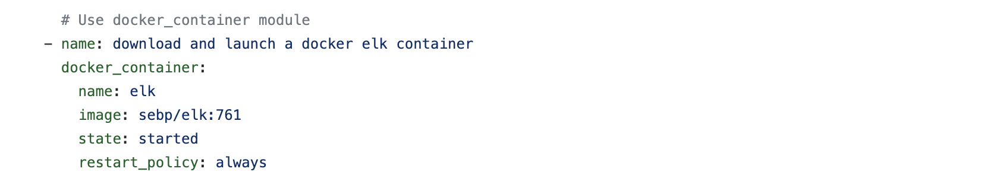

# Project-1-ELK-Stack
### Week 13 - Cloud Security: Automated ELK Stack Deployment


The files in this repository were used to configure the network depicted below.  


These files have been tested and used to generate a live ELK deployment on Azure. They can be used to either recreate the entire deployment pictured above. Alternatively, select portions of the playbook file may be used to install only certain pieces of it, such as Filebeat.

##### Playbook 1: pentest.yml
``` yaml
---
- name: Config Web VM with Docker
  hosts: webservers
  become: true
  tasks:
    - name: docker.io
      apt:
        name: docker.io
        state: present

    - name: Install pip3
      apt:
        name: python3-pip
        state: present

    - name: Install Docker python module
      pip:
        name: docker
        state: present

    - name: download and launch a docker web container
      docker_container:
        name: dvwa
        image: cyberxsecurity/dvwa
        state: started
        restart_policy: always
        published_ports: 80:80

    - name: Enable docker service
      systemd:
        name: docker
        enabled: yes
```

##### Playbook 2: elk.yml
``` yaml
---
- name: Configure ELK VM with Docker
  hosts: elk
  remote_user: janetgomes
  become: true
  tasks:
    # Use apt module
    - name: Install docker.io
      apt:
        update_cache: yes
        name: docker.io
        state: present

      # Use apt module
    - name: Install pip3
      apt:
        force_apt_get: yes
        name: python3-pip
        state: present

      # Use pip module
    - name: Install Docker python module
      pip:
        name: docker
        state: present

      # Use sysctl module
    - name: Use more memory
      sysctl:
        name: vm.max_map_count
        value: "262144"
        state: present
        reload: yes

      # Use docker_container module
    - name: download and launch a docker elk container
      docker_container:
        name: elk
        image: sebp/elk:761
        state: started
        restart_policy: always
        published_ports:
          - 5601:5601
          - 9200:9200
          - 5044:5044

      # Use systemd module
    - name: Enable service docker on boot
      systemd:
        name: docker
        enabled: yes
```

##### Playbook 3: filebeat-playbook.yml
``` yaml
---
- name: Installing and Launch Filebeat
  hosts: webservers
  become: yes
  tasks:
    # Use command module
  - name: Download filebeat .deb file
    command: curl -L -O 
https://artifacts.elastic.co/downloads/beats/filebeat/filebeat-7.4.0-amd64.deb

    # Use command module
  - name: Install filebeat .deb
    command: dpkg -i filebeat-7.4.0-amd64.deb

    # Use copy module
  - name: Drop in filebeat.yml
    copy:
      src: /etc/ansible/filebeat-config.yml
      dest: /etc/filebeat/filebeat.yml

    # Use command module
  - name: Enable and Configure System Module
    command: filebeat modules enable system

    # Use command module
  - name: Setup filebeat
    command: filebeat setup

    # Use command module
  - name: Start filebeat service
    command: service filebeat start

    # Use systemd module
  - name: Enable service filebeat on boot
    systemd:
      name: filebeat
      enabled: yes
 ```
 
 ##### Playbook 4: metricbeat-playbook.yml
``` yaml
 ---
- name: Install metric beat
  hosts: webservers
  become: true
  tasks:
    # Use command module
  - name: Download metricbeat
    command: curl -L -O 
https://artifacts.elastic.co/downloads/beats/metricbeat/metricbeat-7.6.1-amd64.deb

    # Use command module
  - name: install metricbeat
    command: dpkg -i metricbeat-7.6.1-amd64.deb

    # Use copy module
  - name: drop in metricbeat config
    copy:
      src: /etc/ansible/metricbeat-config.yml
      dest: /etc/metricbeat/metricbeat.yml

    # Use command module
  - name: enable and configure docker module for metric beat
    command: metricbeat modules enable docker

    # Use command module
  - name: setup metric beat
    command: metricbeat setup

    # Use command module
  - name: start metric beat
    command: service metricbeat start

    # Use systemd module
  - name: Enable service metricbeat on boot
    systemd:
      name: metricbeat
      enabled: yes 
```

This document contains the following details:
- Description of the Topology
- Access Policies
- ELK Configuration
  - Beats in Use
  - Machines Being Monitored
- How to Use the Ansible Build


### Description of the Topology

The main purpose of this network is to expose a load-balanced and monitored instance of DVWA, the D*mn Vulnerable Web Application.

Load balancing ensures that the application will be highly available, in addition to restricting access to the network.

What aspect of security do load balancers protect? 
- The load balancer provides and externa IP address accessible through the Internet. When the load balancer receives external traffic from the internet into the website, the load balancer systematically distributes the traffic across multiple servers and mitigate DoS attack. The health probe function in the load balancer detects issues with machines, reports them to the load balancer, hence the load balancer stops the traffic to faulty machines and manages with the available machines.

What is the advantage of a jump box?
- A couple advantages of a jumpbox are:
Improve Security: A jump box creates a separation between a user's workstation (which is at high risk of being compromised)   
and the privileged assets within the network. This separation helps to isolate privileged assets so that they aren't directly 
in contact with potentially compromised workstations. Because of their access to potentially sensitive areas, jump boxes are 
usually "hardened" in the extreme.
Improve Productivity: A jump box provides effective access control. It makes it possible for the admin to do their work on the two sub-networks without logging out and into each privileged area.

Integrating an ELK server allows users to easily monitor the vulnerable VMs for changes to the event logs and system metrics.
- What does Filebeat watch for?
Filebeat monitors the log files or locations that you specify, collects log events, and forwards them to either Logstash or Elasticsearch for indexing.
- What does Metricbeat record?
Metricbeat is lightweight agent that can be installed on your specific severs to periodically collect metric data from the opertaing system running on the server. It takes the collected metrics and statistics annd ships it to Logstash.  

The configuration details of each machine may be found below.

| Name                   | Function     | IP Address             | Operating System |
|------------------------|--------------|------------------------|------------------|
| Jumpbox VM: janetgomes | Gateway      | 10.0.0.4/20.213.133.50 | Linux            |
| Web-1 VM               | WebServer    | 10.0.0.9               | Linux            |
| Web-2 VM               | WebServer    | 10.0.0.11              | Linux            |
| ELK VM                 | ElkServer    | 10.1.0.4/20.70.20.66   | Linux            |
| Load Balancer          | Load Balancer| 20.213.82.37           | -                |


### Access Policies

The machines on the internal network are not exposed to the public Internet. 

Only the Jump box machine can accept connections from the Internet. Access to this machine is only allowed from the following IP addresses:
- Public IP of workstation: 174.95.78.27

Machines within the network can only be accessed by the Jump box.
- Which machine did you allow to access your ELK VM? 
My ELK VM can be accessed via Jump box (JumpBoxProvisioner / admin: janetgomes)
- What was its IP address?
It's private IP address is 10.0.0.4.

A summary of the access policies in place can be found in the table below.

| Name                     | Publicly Accessible | Allowed IP Addresses      | Port      |
|--------------------------|---------------------|---------------------------|-----------|
| Jump Box VM (janetgomes) | No                  | 20.213.133.50 (Public IP) | SSH P22   |
| Web-1 VM                 | No                  | 10.0.0.9 (janetgomes)     | SSH P22   |
| Web-2 VM                 | No                  | 10.0.0.11 (janetgomes)    | SSH P22   |
| ELK VM                   | No                  | 20.70.20.66 (Public IP)   | TCP P5601 |
| Load Balancer            | No                  | 20.213.82.37 (Public IP)  | HTTP P80  |

### Elk Configuration

Ansible was used to automate configuration of the ELK machine. No configuration was performed manually, which is advantageous because Ansible allows us to automate the creation, configuration and management of machines.

- What is the main advantage of automating configuration with Ansible?
Ansible can be used to automate tasks (making configurations, moving files, ensure servers are updated etc.) for groups of servers from one control machine. Ansible assists in easily deploying multitier apps. Writing a playbook, listing all the tasks that need to be done, allows Ansible to get the system to the state we require.  

The playbook implements the following tasks:


- The header of the Ansible playbook specifies the machine or group of machines as well as remote user.
- Install Packages: Installs the docker.io and python3-pip apt packages.
- docker.io: The Docker engine used for running containers.
- python3-pip: Package used to install Python software.


- Install pip module: Installs docker pip package, which is required by Ansible, for controlling the state of docker containers.
- Other tasks that do the following:


- Increase virtual memory: Set the 'vm.max_map_count' to '262144'
- This is a system requirement for the ELK container.
- This configures the machine being configured, the target VM, to use more memory. The ELK container will not run without this setting.


- The Ansible 'sysctl' module is used to configure the memory requirement such as this setting is automatically run if your VM has been restarted.
- The most common reason that the 'ELK' container does not run, is caused by this settiing being incorrect.
- To set this value permanently, update the vm.max_map_count setting in /etc/sysctl.conf.
- Ansible sysctl


- published_ports: Configures the container to start with the following port mappings:
- 5601:5601
- 9200:9200
- 5044:5044
- This command publishes the following ports, which are needed for proper operation of the ELK stack:
- 5601 (Kibana web interface)
- 9200 (Elasticsearch JSON interface)
- 5044 (Logstash Beats interface, receive logs from Beats such as Filebeat)



- restart_policy: Always starts the container sebp/elk:761

The following screenshot displays the result of running 'docker ps' after successfully configuring the ELK instance.


### Target Machines & Beats

This ELK server is configured to monitor the following machines:
- Web-1 : 10.0.0.9
- Web-2 : 10.0.0.11

We have installed the following Beats on these machines:
- Filebeat & Metricbeat

These Beats allow us to collect the following information from each machine:
- filebeat:collects log events
- metricbeat:collect metrics from the operating system and from services running on the server

### Using the Playbook

In order to use the playbook, you will need to have an Ansible control node already configured. Assuming you have such a control node provisioned: 

SSH into the control node and follow the steps below:

Which file is the playbook? Where do you copy it?
- Copy the 'install-elk.yml' file to '/etc/ansible'.

Which file do you update to make Ansible run the playbook on a specific machine? How do I specify which machine to install the ELK server on versus which to install Filebeat on?
- Update the '/etc/ansible/hosts' file to include a group called [elk] and specify the IP address of the elk VM created in Azure.

Which URL do you navigate to in order to check that the ELK server is running?
- Run the playbook, and navigate to http://20.70.20.66:5601/app/kibana to check that the installation worked as expected.


## Bonus 
### Provide the specific commands the user will need to run to download the playbook, update the files, etc.:

1. To download metricbeat playbook: ansible-playbook metricbeat-playbook.yml

3. To download filebeat playbook: ansible-playbook filebeat-playbook.yml
